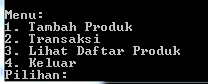

# Aplikasi Point of Sale (POS) dengan Python dan MySQL

Aplikasi Point of Sale (POS) ini adalah sistem yang dikembangkan dengan menggunakan bahasa pemrograman Python dan database MySQL. Aplikasi ini memungkinkan pengguna untuk mengelola produk, melakukan transaksi, dan mencetak nota transaksi dalam format PDF.

## Fitur

- Tambahkan produk baru ke dalam database.
- Lihat daftar produk yang tersedia.
- Lakukan transaksi dengan mengurangi stok produk.
- Cetak nota transaksi dalam format PDF.

## Instalasi

1. Pastikan Anda telah menginstal Python di komputer Anda. Jika belum, Anda dapat mengunduhnya dari [Python's Official Website](https://www.python.org/downloads/).

2. Instal modul MySQL Connector dan FPDF dengan perintah berikut:

   ```
   pip install mysql-connector-python
   pip install fpdf
   ```

3. Pastikan Anda memiliki MySQL Server terinstal. Anda dapat menggunakan [MySQL Community Edition](https://dev.mysql.com/downloads/mysql/) atau [XAMPP](https://www.apachefriends.org/index.html) untuk mengelola database.

4. Buat sebuah database MySQL untuk aplikasi POS dan sesuaikan pengaturan koneksi database pada file kode aplikasi.

```
CREATE DATABASE posdb;
USE posdb;

CREATE TABLE products (
    product_id INT AUTO_INCREMENT PRIMARY KEY,
    product_name VARCHAR(255),
    price DECIMAL(10, 2),
    stock INT
);

CREATE TABLE transactions (
    transaction_id INT AUTO_INCREMENT PRIMARY KEY,
    product_id INT,
    quantity INT,
    total_amount DECIMAL(10, 2)
);
5. Jalankan aplikasi dengan menjalankan file `main.py`.
```
## Penggunaan

1. Pilih opsi menu yang sesuai:
   - Tambah Produk
   - Transaksi
   - Lihat Daftar Produk
   - Keluar

2. Jika Anda memilih "Tambah Produk", masukkan detail produk, termasuk nama, harga, dan stok.

3. Jika Anda memilih "Transaksi", Anda dapat memilih produk yang akan dibeli dan memasukkan jumlahnya. Aplikasi akan mencatat transaksi dan mencetak nota transaksi dalam format PDF.

4. Opsi "Lihat Daftar Produk" memungkinkan Anda melihat daftar produk yang tersedia.

5. Untuk keluar dari aplikasi, pilih "Keluar".

## Struktur Proyek

- `main.py`: File utama aplikasi yang berisi logika menu dan penggunaan fungsi-fungsi lainnya.
- `database.sql`: File SQL untuk membuat struktur tabel database.
- `README.md`: Dokumentasi proyek ini.
- `LICENSE`: Lisensi proyek (gunakan yang sesuai dengan kebutuhan Anda).
- Folder `reports`: Tempat nota transaksi akan disimpan dalam format PDF.
- Folder `assets`: Tempat Anda dapat menyimpan aset-aset seperti gambar produk jika diperlukan.

## Kontribusi

Jika Anda ingin berkontribusi pada proyek ini, silakan buat *fork* proyek ini, lakukan perubahan yang diperlukan, dan buat *pull request*. Kami akan meninjau kontribusi Anda dengan senang hati.

## Lisensi

Proyek ini dilisensikan di bawah lisensi [MIT](LICENSE).
